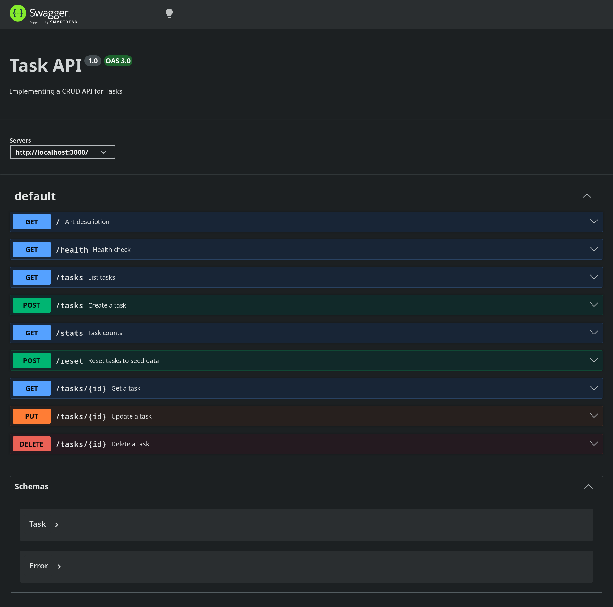

# TASK API

A CRUD API using express to manage user tasks. Create a title, mark it as done. Simple as that.

Authentication (sign up, log in, log out, and token-protected routes) is handled via Supabase Auth, with a public route and a Bearer-token-protected route to demonstrate both.

## Get Started

**Clone the repo**

```bash
git clone https://github.com/oreocapybara/be-internship-crud-api.git
```

**Install Dependencies**

```bash
npm install #or
npm i
```

**Environment Variables**

Copy `.env.example` to `.env` and fill in your Supabase project credentials (found in your Supabase project's API settings):

| Variable       | Description                                  |
| -------------- | --------------------------------------------- |
| `DATABASE_URL` | PostgreSQL connection string for the tasks DB |
| `SUPABASE_URL` | Your Supabase project URL                     |
| `SUPABASE_KEY` | Your Supabase project's anon/public API key   |
| `PORT`         | Port the API listens on (defaults to `3000`)  |

**Run it**

```bash
cp .env.example .env && docker compose up 
```

## Architecture

Layered: routes → services → repositories.

- **Routes** (`src/routes`) parse the request, call a service, send the response. No business logic.
- **Services** (`src/services`) hold the business logic and validation. Throw `ValidationError`/`NotFoundError` on bad input.
- **Repositories** (`src/repositories`) hold the database using PostgreSQL. Contains SQL commands for CRUD. Routes and services never touch it directly but calls its CRUD functions.

Errors thrown by services bubble up to `src/middleware/error-handler.js`, which turns them into the right HTTP status.

## PostgreSQL and Docker
PostgreSQL was used for the database which is wrapped in a docker conatiner. 

## Swagger UI
Go to `http://localhost:3000/docs` to use swagger UI for API testing. 
Protected routes are marked with a lock icon — click **Authorize** and 
paste an `access_token` (from `/auth/login`) as a Bearer token to call them from the UI.


## Authentication

| Endpoint                       | Description                          | Auth Required |
| ------------------------------- | ------------------------------------ | ------------- |
| `POST /auth/signup`             | Create a new user account            | No            |
| `POST /auth/login`              | Log in and receive a session token   | No            |
| `GET /public/info`              | Publicly accessible info             | No            |
| `GET /protected/profile`        | Return the authenticated user's info | Yes (Bearer)  |
| `POST /auth/logout`             | Invalidate the current session       | Yes (Bearer)  |

Protected routes expect `Authorization: Bearer <access_token>`, where the token comes from the `session.access_token` field returned by `/auth/login` (or `/auth/signup`).

## Task Endpoints

| Endpoint                               | Description                       | Response          |
| -------------------------------------- | --------------------------------- | ----------------- |
| [`GET /`](#get-)                       | API Metadata                      | metadata          |
| [`GET /health`](#get-health)           | Health Check                      | **status: ok**    |
| [`GET /tasks`](#get-tasks)             | Return all tasks                  | array of objects  |
| [`GET /stats`](#get-stats)             | Task counts (total/done/open)     | object            |
| [`POST /reset`](#post-reset)           | Reset tasks to seed data          | array of objects  |
| [`POST /tasks`](#post-tasks)           | Creates a task                    | **201, 400**      |
| [`GET /tasks/:id`](#get-tasksid)       | Return a task                     | **200, 404**      |
| [`PUT /tasks/:id`](#put-tasksid)       | Update a task                     | **201, 400, 404** |
| [`DELETE /tasks/:id`](#delete-tasksid) | Delete a task                     | **204, 404**      |
| [`GET /docs`](#get-docs)               | Interactive API docs (Swagger UI) | HTML page         |

### `GET /`

Returns the metadata of the API

**Response**

```json
{
	"name": "Task API",
	"version": "1.0",
	"endpoints": ["/tasks"]
}
```

**Example:**

```bash
curl -i http://localhost:3000/
```

### `GET /health`

Health check endpoint.

**Response**

```json
{ "status"": "ok" }
```

**Example:**

```bash
curl -i http://localhost:3000/health
```

### `GET /tasks`

Returns the list of tasks

**Response**

```json
[
	{ "id": 1, "title": "Do Laundry", "done": false },
	{ "id": 2, "title": "Fix Laptop", "done": true },
	{ "id": 3, "title": "Have a Video Chat", "done": false }
]
```

**Example:**

```bash
curl -i http://localhost:3000/tasks
```

### `GET /stats`

Returns task counts

**Response**

```json
{ "total": 3, "done": 1, "open": 2 }
```

**Example:**

```bash
curl -i http://localhost:3000/stats
```

### `POST /reset`

Resets tasks back to the seed data

**Response**

```json
[
	{ "id": 1, "title": "Do Laundry", "done": false },
	{ "id": 2, "title": "Fix Laptop", "done": true },
	{ "id": 3, "title": "Have a Video Chat", "done": false }
]
```

**Example:**

```bash
curl -X POST http://localhost:3000/reset
```

### `POST /tasks`

Creates a task
**Response Body**

```json
{ "title": "Buy Coffee Milk" }
```

**Response (201)**

```json
{ "id": 4, "title": "Buy Coffee Milk", "done": false }
```

**Response (400)**

```json
{ "error": "Title is required and cannot be empty" }
```

**Example:**

```bash
curl -X POST http://localhost:3000/tasks \
  -H "Content-Type: application/json" \
  -d '{"title": "Buy Coffee Milk"}'
```

### `GET /tasks/:id`

Return a specific task

**Request URL**

```url
http://localhost:3000/tasks/4
```

**Response (200)**

```json
{
	"id": 4,
	"title": "Buy Coffee Milk",
	"done": false
}
```

**Response (404)**

```json
{ "error": "Task 4 NOT Found" }
```

**Example:**

```bash
curl -X 'GET' \
  'http://localhost:3000/tasks/4' \
  -H 'accept: application/json'
```

### `PUT /tasks/:id`

Update a specific task

**Request Body**

```json
{
	"title": "Buy Coffee Milk",
	"done": true
}
```

**Response (201)**

```json
{
	"id": 4,
	"title": "Buy Coffee Milk",
	"done": true
}
```

**Response (400)**

```json
{ "error": "Request Body Must Have TITLE and/or DONE" }
```

**Response (404)**

```json
{ "error": "Task 4 NOT Found" }
```

**Example:**

```bash
curl -X 'PUT' \
  'http://localhost:3000/tasks/4' \
  -H 'accept: application/json' \
  -H 'Content-Type: application/json' \
  -d '{
  "title": "Buy Coffee Milk",
  "done": true
}'
```

### `DELETE /tasks/:id`

Delete a specific task

**Request URL**

```json
http://localhost:3000/tasks/4
```

**Response (204)**
Empty Body - nothing to return

**Response (404)**

```json
{ "error": "Task 4 NOT Found" }
```

**Example:**

```bash
curl -X DELETE http://localhost:3000/tasks/4
```

### `GET /docs`

Serves the interactive Swagger UI, generated from `openapi.json`

**Request URL**

```json
http://localhost:3000/docs
```

**Response**
HTML page (Swagger UI) — not part of the JSON task API
